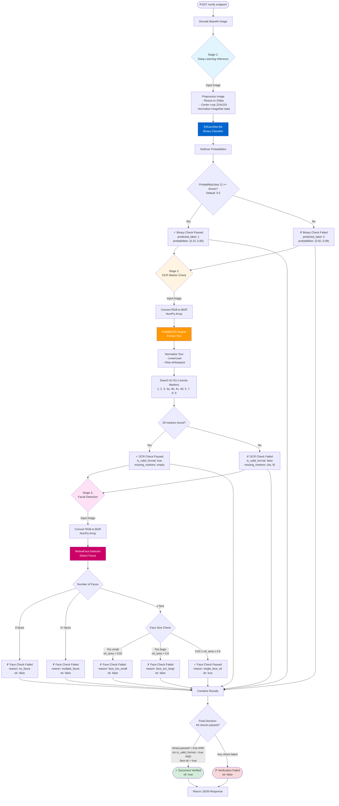

# Document Verification Project

A comprehensive AI-based, OCR-based, and facial verification-based document verification system using **EfficientNet-B0**, **PaddleOCR**, and **RetinaFace** for verification of EU Driving License. This application automatically distinguishes between authentic license images and other document types.

## 1. Overview

- **Binary Classification**: EfficientNet-B0 neural network trained to classify documents as licenses (positive class: 1) or other document types (negative class: 0)
- **Balanced Dataset**: Inverse frequency class weighting automatically handles imbalanced training data
- **Large-Scale Dataset**: ~3,000 license images + 866 diverse negative examples spanning 11 document categories
- **Reproducible Training**: Deterministic random seeds, seeded dataset splits, and comprehensive logging ensure consistent results
- **Production-Ready**: Fully instrumented training pipeline with model checkpointing, validation monitoring, and detailed logging

## 2. Features

- **EfficientNet-B0 Transfer Learning**: Leverages pretrained ImageNet weights for improved generalization
- **Automated License Detection**: Binary classification distinguishing licenses from diverse document types
- **Class Weight Balancing**: Inverse frequency weighting automatically computed from dataset composition
- **Deterministic Reproducibility**: Fixed seeds for Python, NumPy, PyTorch, and CUDA ensure consistent results across runs
- **Comprehensive Logging**: Dual-output logging (file + console) with timestamps, run metadata, batch-level progress, and performance metrics
- **Intelligent Data Loading**: Recursive directory traversal supporting multi-level folder hierarchies for flexible data organization
- **Model Checkpointing**: Automatic best-model selection based on validation accuracy with dual checkpoint strategy (best + final)
- **GPU/CPU Flexibility**: Automatic hardware detection with CUDA support and proper memory management (pinned memory for data loading)
- **Data Augmentation**: Random cropping, horizontal flips, and ImageNet normalization for improved robustness

## 3. Project Structure

```
document_verification/
├── model.py                    # Main training script (EfficientNet-B0, ~584 lines)
├── app.py                      # FastAPI inference server (~525 lines, heavily commented)
│                              # Features: model loading, base64 input validation, 3-stage verification
├── demo_ocr.ipynb              # Jupyter notebook demonstrating PaddleOCR-based verification
│                              # Extracts text and verifies presence of EU license markers
├── demo_face_detection.ipynb   # Jupyter notebook demonstrating RetinaFace-based verification
│                              # Detects single face and validates size/position
├── requirements.txt            # Project dependencies (fastapi, uvicorn, pytest, requests, etc.)
├── README.md                   # Project documentation (this file)
├── LICENSE                     # MIT License
├── data/                       # Training and validation data (~3,866 total samples)
│   ├── Original/               # Positive class: 3,000 license images
│   │                          # Supported formats: PNG, JPG, JPEG, BMP, GIF, TIFF
│   ├── random_doc_images/      # Negative class: 866 diverse documents
│   │   ├── blank_pages/
│   │   ├── book_front_covers/
│   │   ├── book_pages/
│   │   ├── books/
│   │   ├── driving_license/
│   │   ├── invoice/
│   │   ├── letters/
│   │   ├── national_certificates/
│   │   ├── newspapers/
│   │   ├── passport/
│   │   └── tax_documents/
│   ├── truth_tables/           # Ground truth JSON annotations (~3,000+ metadata files)
│   ├── README.md               # Data documentation
│   └── Original/README.md
├── models/                     # Model output directory (final and best checkpoints)
│   └── README.md               # Models folder documentation
├── logs/                       # Training logs (appending to single log file)
│   └── train_log.txt           # Timestamped training history with run metadata
├── tests/                      # Integration test suite
│   └── test_api.py             # Unit tests for /verify endpoint (uses pytest + requests)
├── checkpoints/                # Alternate checkpoint location (for Kaggle environments)
└── .git/                       # Version control
```

## 4. Data Structure

### 4.1 Positive Class (License Images)
- **Location**: `data/Original/`
- **Count**: 3,000 PNG images
- **Purpose**: Primary training examples for license recognition
- **Format Support**: PNG, JPG, JPEG, BMP, GIF, TIFF (auto-detected by extension)

### 4.2 Negative Class (Other Documents)
- **Location**: `data/random_doc_images/`
- **Total Count**: 866 diverse images
- **Categories**: 11 document types including:
  - Blank pages, book front covers, book pages, books
  - Driving licenses, invoices, letters
  - National certificates, newspapers, passports, tax documents
- **Purpose**: Training diverse negative examples to improve model robustness and reduce false positives

### 4.3 Ground Truth Metadata
- **Location**: `data/truth_tables/`
- **Format**: JSON files with image annotations
- **Count**: ~3,000+ metadata files corresponding to `Original/` images
- **Purpose**: Validation and evaluation reference data

### 4.4 Dataset Statistics (as of latest training)
- **Total Samples**: 3,866
- **Positive (Licenses)**: 3,000 (77.6%)
- **Negative (Other Docs)**: 866 (22.4%)
- **Train Split**: 3,093 (80%)
- **Validation Split**: 773 (20%)
- **Class Weight (Negative)**: 2.23 (upweighted due to underrepresentation)
- **Class Weight (Positive)**: 0.64 (downweighted due to overrepresentation)

## 5. Model Architecture

### 5.1 Base Architecture
- **Model**: EfficientNet-B0 (pretrained on ImageNet)
- **Pretrained Weights**: ImageNet-1k (automatically downloaded on first run)
- **Input Resolution**: 224 × 224 RGB pixels
- **Base Feature Extractor**: 1,280 output channels
- **Classification Head**: Single Linear layer (1,280 → 2 classes)

### 5.2 Normalization
- **Mean**: [0.485, 0.456, 0.406] (ImageNet statistics)
- **Std Dev**: [0.229, 0.224, 0.225] (ImageNet statistics)
- **Color Space**: RGB

### 5.3 Training Configuration
- **Optimizer**: Adam (lr=1e-4, default β₁=0.9, β₂=0.999)
- **Loss Function**: CrossEntropyLoss with class weight balancing
- **Class Weights**: Computed as `total_samples / (num_classes × class_counts)`
  - Automatically handles imbalanced class distribution
  - Upweights underrepresented negative class
  - Downweights overrepresented positive class

### 5.4 Data Augmentation (Training Only)
- **Resize**: Shorter side to 256 pixels
- **Random Resized Crop**: 224×224 with scale factor [0.8, 1.0]
- **Random Horizontal Flip**: 50% probability
- **Normalization**: Applied to all splits

### 5.5 Inference (Validation & Test)
- **Resize**: Shorter side to 256 pixels
- **Center Crop**: 224×224 from center
- **Normalization**: ImageNet statistics applied

## 6. Getting Started

### 6.1 Prerequisites
- Python 3.8 or higher
- pip or conda package manager
- Optional: CUDA 11.0+ for GPU acceleration (recommended for faster training)

### 6.2 Install Dependencies
```bash
pip install -r requirements.txt
```

**Dependencies**:
- `torch` - Deep learning framework
- `torchvision` - Computer vision utilities and pretrained models
- `numpy` - Numerical computing
- `Pillow` - Image loading and processing
- `opencv-python` - Image manipulation
- `matplotlib` - Visualization (for potential plotting)
- `scipy` - Scientific computing utilities
- `paddlepaddle` & `paddleocr` - OCR capabilities for document text extraction
- `retinaface` - Face detection (optional advanced feature)

### 6.3 Prepare Data
```bash
# Ensure directory structure exists:
data/
├── Original/          # Place 3,000+ license images here
├── random_doc_images/ # Place diverse non-license documents organized by category
│   ├── blank_pages/
│   ├── books/
│   ├── invoices/
│   └── ... (other categories)
└── truth_tables/      # JSON metadata files (optional for evaluation)
```

### 6.4 Configure Training (Optional)
Edit hyperparameters in `model.py` (lines 45-58):
```python
NUM_EPOCHS = 10           # Number of training passes through dataset
BATCH_SIZE = 32           # Samples per batch (reduce for low-memory GPUs)
LEARNING_RATE = 1e-4      # Adam optimizer step size
VAL_SPLIT = 0.2           # Fraction of data for validation (80/20 split)
SEED = 42                 # Random seed for reproducibility
```

### 6.5 Train the Model
```bash
python model.py
```

**What happens during training**:
1. Data is loaded from `Original/` and `random_doc_images/` directories
2. Dataset is split deterministically: 80% training, 20% validation
3. Class weights are computed to balance the imbalanced dataset
4. Model trains for 10 epochs with loss/accuracy logged each batch
5. Best model is saved when validation accuracy improves
6. Training log is appended to `logs/train_log.txt`
7. Checkpoints saved to `models/` directory

### 6.6 Monitor Training Progress
```bash
# View training logs in real-time:
tail -f logs/train_log.txt

# Or open the log file in your editor:
cat logs/train_log.txt
```

**Log output includes**:
- Run metadata (date, time, environment)
- Device information (CPU vs GPU)
- Dataset composition and class weights
- Per-epoch loss and accuracy for both train/val phases
- Batch-level progress (every 50 batches)
- Best model checkpoint location
- Total training duration

### 6.7 Retrieve Trained Models
After successful training:
- **Best Model**: `models/best_efficientnet_binary.pt`
  - Best validation accuracy checkpoint
  - Recommended for inference/deployment
- **Final Model**: `models/final_efficientnet_binary.pt`
  - Final weights after all epochs
  - For comparison or analysis

## 7. FastAPI Inference Server

### 7.1 Overview
The project includes a production-ready FastAPI inference server (`app.py`) that exposes a `/verify` endpoint for real-time document verification. The server implements a **three-stage verification pipeline**:

1. **Binary Classifier**: Determines if the image is a license document
2. **OCR Verification**: Extracts text and validates presence of required EU license markers
3. **Face Detection**: Ensures a single face is present with reasonable size and position

### 7.2 Verification Pipeline Flowchart



**Key Components:**

| Component | Technology | Purpose | Output |
|-----------|-----------|---------|--------|
| **Deep Learning Inference** | EfficientNet-B0 | Binary classification (license vs. non-license) | `predicted_label`, `probabilities(2)`, `passed` |
| **OCR Marker Check** | PaddleOCR | Extract text and verify EU license markers (1-9, 4a-4d) | `found_markers`, `missing_markers`, `is_valid_format` |
| **Facial Detection** | RetinaFace | Detect and validate single face with proper size | `num_faces`, `faces list`, `ok`, `reason` |

**Decision Logic:**
- **Overall Pass**: `ok = binary.passed AND ocr.is_valid_format AND face.ok`
- **Threshold**: Configurable via `thresh_binary` (default: 0.5)
- **Face Size**: Relative area must be between 2% and 60% of image
- **Markers**: All 11 required markers must be found for OCR pass

### 7.3 Running the Server

1. **Start the inference server**:
```bash
uvicorn app:app --host 0.0.0.0 --port 8000
```

2. **Send a verification request** (using curl or Python):
```bash
# Example with Python requests
import requests
import base64

with open('path/to/image.png', 'rb') as f:
    b64_image = base64.b64encode(f.read()).decode('ascii')

response = requests.post(
    'http://127.0.0.1:8000/verify',
    json={'image_base64': b64_image, 'thresh_binary': 0.5}
)
print(response.json())
```

### 7.4 API Response Example

```json
{
  "ok": true,
  "binary": {
    "predicted_label": 1,
    "probabilities": [0.15, 0.85],
    "passed": true
  },
  "ocr": {
    "available": true,
    "raw_text": ["1.", "2.", "3.", ...],
    "found_markers": ["1", "2", "3", "4a", "4b", "4c", "4d", "5", "7", "8", "9"],
    "missing_markers": [],
    "is_valid_format": true
  },
  "face": {
    "available": true,
    "ok": true,
    "reason": "single_face_ok",
    "num_faces": 1,
    "faces": [{"score": 0.98, "box": [100, 150, 300, 400]}]
  }
}
```

### 7.5 Configuration
- **`image_base64`** (required): Base64-encoded image or data URI
- **`thresh_binary`** (optional): Confidence threshold for license class (default: 0.5)

### 7.6 Startup Model Loading
The server loads all models on startup (`load_models` function):
- EfficientNet-B0 classifier from `models/best_efficientnet_binary.pt` or `models/final_efficientnet_binary.pt`
- PaddleOCR engine (if installed)
- RetinaFace detector (if installed)
- Common torchvision transforms for preprocessing

### 7.7 Thread-Safe Inference
All blocking operations (model inference, OCR, face detection) are executed in a thread pool to avoid blocking FastAPI's async event loop.

## 8. Demo Notebooks

### 8.1 OCR-Based Verification (`demo_ocr.ipynb`)
A Jupyter notebook that demonstrates OCR-based verification of EU driving licenses using PaddleOCR:
- Loads images from `data/Original/` and `data/random_doc_images/`
- Extracts text using PaddleOCR
- Parses extracted text to find required marker fields (1, 2, 3, 4a, 4b, 4c, 4d, 5, 7, 8, 9)
- Reports found and missing markers

**Usage**:
```bash
jupyter notebook demo_ocr.ipynb
```

### 8.2 Face Detection-Based Verification (`demo_face_detection.ipynb`)
A Jupyter notebook that demonstrates face detection and verification using RetinaFace:
- Detects faces in images using RetinaFace
- Validates that exactly one face is present
- Checks face size is within reasonable bounds (relative to image)
- Optionally validates face position within a region of interest (ROI)

**Usage**:
```bash
jupyter notebook demo_face_detection.ipynb
```

## 9. Integration Testing

### 9.1 Test Suite (`tests/test_api.py`)
The project includes pytest-based integration tests that exercise the `/verify` endpoint:
- Samples `n` positive images from `data/Original/`
- Samples `n` negative images from `data/random_doc_images/`
- Posts each image to the running server
- Asserts response structure and HTTP status codes

### 9.2 Running Tests

1. **Start the server** in one terminal:
```bash
uvicorn app:app --port 8000
```

2. **Run tests** in another terminal:
```bash
# Run with default 3 samples per class
pytest tests/test_api.py -v

# Or customize sample count and server URL
SAMPLE_N=5 TEST_SERVER_URL=http://127.0.0.1:8000 pytest tests/test_api.py -v
```

### 9.3 Test Configuration
- **`SAMPLE_N`** (env var): Number of images to sample per class (default: 3)
- **`TEST_SERVER_URL`** (env var): Server endpoint (default: http://127.0.0.1:8000)

## 10. Docker Deployment

### 10.1 Overview
The project includes a complete Docker setup for containerized deployment:
- **`Dockerfile`**: Multi-stage image based on Python 3.11-slim with system dependencies, non-root user, and health checks
- **`docker-compose.yml`**: Orchestration file for local development with API and Jupyter services
- **`.dockerignore`**: Build context optimization excluding large data/model files

### 10.2 Quick Start with Docker Compose

1. **Build and start services**:
```bash
docker-compose up --build
```

2. **Access the API**:
- Swagger UI: http://localhost:8000/docs
- API endpoint: http://localhost:8000/verify
- Jupyter (optional): http://localhost:8888

3. **Run tests against containerized server**:
```bash
SAMPLE_N=5 TEST_SERVER_URL=http://127.0.0.1:8000 pytest tests/test_api.py -v
```

4. **Stop services**:
```bash
docker-compose down
```

### 10.3 Docker Run (Without Compose)

```bash
# Build the image
docker build -t document-verification-api:latest .

# Run the container
docker run -d \
  --name document-verification-api \
  -p 8000:8000 \
  -v $(pwd)/models:/app/models:ro \
  -v $(pwd)/logs:/app/logs \
  -v $(pwd)/data:/app/data:ro \
  document-verification-api:latest

# Verify it's running
curl http://localhost:8000/docs

# Stop the container
docker stop document-verification-api
docker rm document-verification-api
```

### 10.4 Volume Mounts

The Docker setup uses the following volume mounts:

| Host Path | Container Path | Mode | Purpose |
|-----------|-----------------|------|---------|
| `./models` | `/app/models` | ro | Pre-trained model weights |
| `./logs` | `/app/logs` | rw | Training/inference logs for persistence |
| `./data` | `/app/data` | ro | Input images for batch inference |

### 10.5 Configuration via Environment Variables

```bash
# Start with custom log level
docker-compose up -e LOG_LEVEL=debug

# Or with docker run
docker run -e LOG_LEVEL=debug -p 8000:8000 document-verification-api:latest
```

### 10.6 Health Checks

The Dockerfile includes a health check that validates the API every 30 seconds:
```
HEALTHCHECK --interval=30s --timeout=10s --start-period=5s --retries=3
```

Monitor container health:
```bash
docker ps --format "table {{.Names}}\t{{.Status}}"
```

### 10.7 Logging

View container logs in real-time:
```bash
# With docker-compose
docker-compose logs -f api

# With docker run
docker logs -f document-verification-api
```

### 10.8 Production Considerations

For production deployment:
1. **Use a reverse proxy** (Nginx, Traefik) to handle SSL/TLS and load balancing
2. **Set environment variables** for configuration (log level, model path, port)
3. **Pin exact image versions** in Dockerfile (e.g., `python:3.11.0-slim` instead of `python:3.11-slim`)
4. **Use secrets management** for sensitive data (API keys, database credentials)
5. **Enable resource limits** in docker-compose (CPU, memory)
6. **Implement monitoring** (Prometheus, Grafana) and logging (ELK, Splunk)

See [DOCKER.md](DOCKER.md) for comprehensive Docker deployment guide including GPU support, Kubernetes, and advanced configurations.

## 11. Configuration

All hyperparameters are defined in `model.py` (hardcoded configuration block, lines 45-58):

| Parameter | Default | Description |
|-----------|---------|-------------|
| `NUM_EPOCHS` | 10 | Number of complete passes through training dataset |
| `BATCH_SIZE` | 32 | Number of samples processed per gradient update |
| `LEARNING_RATE` | 1e-4 | Adam optimizer step size (lower = slower but more stable learning) |
| `VAL_SPLIT` | 0.2 | Fraction of data reserved for validation (0.2 = 80/20 split) |
| `SEED` | 42 | Random seed for reproducible train/val splits and initialization |
| `DATA_DIR` | `./data` | Root directory containing `Original/` and `random_doc_images/` |
| `OUTPUT_DIR` | `./models` | Directory for saving checkpoints (Kaggle: `./checkpoints`) |
| `LOG_DIR` | `./logs` | Directory for training logs |

### 11.1 Environment Detection
The script automatically detects the execution environment:
- **Kaggle**: Sets `DATA_DIR=/kaggle/input/eu-driver-lincense/data` and `OUTPUT_DIR=./checkpoints`
- **Local/Server**: Uses relative paths (`./data`, `./models`, `./logs`)

### 11.2 Advanced Configuration
For fine-tuning:
- Reduce `BATCH_SIZE` if running out of GPU memory
- Increase `LEARNING_RATE` slightly for faster convergence (use cautiously)
- Adjust `NUM_EPOCHS` based on convergence patterns observed in logs
- Modify `VAL_SPLIT` for different train/val proportions (default 80/20 recommended)

## 12. Training Pipeline Details

### 12.1 Data Processing
1. **Image Discovery**: Recursive directory traversal finds all images in `Original/` and `random_doc_images/`
2. **Format Support**: Automatically detects PNG, JPG, JPEG, BMP, GIF, TIFF files
3. **Label Assignment**: 
   - Positive class (1): Images from `Original/`
   - Negative class (0): Images from `random_doc_images/` and subdirectories
4. **Custom Dataset**: `CustomDataset` class handles efficient loading and caching

### 12.2 Preprocessing Pipeline
**Training**:
1. Resize shorter side to 256 pixels
2. Random resized crop to 224×224 with scale [0.8, 1.0]
3. Random horizontal flip (50% probability)
4. Convert to tensor
5. Normalize with ImageNet statistics

**Validation**:
1. Resize to 256 pixels (shorter side)
2. Center crop to 224×224
3. Convert to tensor
4. Normalize with ImageNet statistics

### 12.3 Training Loop
```
For each epoch:
  For each phase (train/val):
    For each batch:
      1. Forward pass through EfficientNet-B0
      2. Compute weighted cross-entropy loss
      3. [Train only] Backward pass and optimizer step
      4. Track loss and accuracy
    Log epoch loss/accuracy
    [Val only] Check if validation accuracy improved
    [Val only] Save checkpoint if new best model found
```

### 12.4 Class Weight Computation
```
weight[class] = total_samples / (num_classes × count[class])
```

Example from dataset (3,866 total):
- Negative (866 samples): weight = 3866 / (2 × 866) = 2.23
- Positive (3000 samples): weight = 3866 / (2 × 3000) = 0.64

This upweights the underrepresented negative class and downweights the overrepresented positive class.

### 12.5 Reproducibility Features
1. **Seeding**: Set seeds for Python `random`, NumPy, PyTorch CPU, and all CUDA devices
2. **Deterministic Split**: Uses `torch.Generator` with fixed seed for train/val split
3. **Logged Metadata**: Run start time, seed value, device information all logged
4. **Validation**: Same seed (42) guarantees identical train/val splits across runs

## 13. Code Architecture

### 13.1 Main Components
- **`set_seed(seed)`**: Initializes all random number generators for reproducibility
- **`CustomDataset`**: PyTorch Dataset subclass for image loading and transformation
- **`create_dataloaders()`**: Loads data, computes class weights, creates DataLoaders (584 lines total)
- **`create_model()`**: Instantiates EfficientNet-B0 and replaces classification head
- **`train_model()`**: Main training loop with validation, checkpointing, and logging
- **`main()`**: Orchestrates the complete pipeline

### 13.2 Logging System
- **Dual output**: Logs written to both file (`logs/train_log.txt`) and console simultaneously
- **Persistent**: All runs append to the same log file with run separators
- **Timestamped**: Each log entry includes human-readable timestamp (YYYY-MM-DD HH:MM:SS)
- **Batch-level**: Progress logged every 50 batches during training
- **Comprehensive**: Logs include metrics, file paths, device info, and metadata

## 14. Requirements

- **Python**: 3.8+
- **PyTorch**: 1.9+ (with torchvision)
- **Key Libraries**:
  - `torch` - Deep learning
  - `torchvision` - Vision models and transforms
  - `numpy` - Numerical operations
  - `Pillow` - Image I/O
  - `opencv-python` - Image processing
  - `paddlepaddle` & `paddleocr` - OCR utilities
  - `scipy` - Scientific functions
  - `matplotlib` - Visualization

See `requirements.txt` for exact versions.

## 15. Best Practices & Troubleshooting

### 15.1 Data Preparation
- ✓ Ensure all images in `data/Original/` are valid license documents (positive examples)
- ✓ Place diverse non-license documents in `data/random_doc_images/` and subfolders (negative examples)
- ✓ Verify image files have supported extensions (.png, .jpg, .jpeg, .bmp, .gif, .tiff)
- ✓ Remove corrupted or unreadable images to avoid DataLoader errors

### 15.2 Training Optimization
- ✓ Check `logs/train_log.txt` regularly to monitor loss/accuracy curves
- ✓ If memory errors occur, reduce `BATCH_SIZE` in `model.py`
- ✓ If training is slow on CPU, consider using GPU (install CUDA-enabled PyTorch)
- ✓ For faster experimentation, reduce `NUM_EPOCHS` and test with subset of data

### 15.3 Reproducibility
- ✓ Always use the same `SEED` value (default: 42) for consistent splits
- ✓ Keep hardware consistent (CPU vs GPU) as they may produce slightly different floating-point results
- ✓ Archive `requirements.txt` versions if exact reproducibility is critical

### 15.4 Troubleshooting Common Issues

**Issue**: `FileNotFoundError: data/Original/ not found`
- **Solution**: Ensure data directory structure matches project structure; place license images in `data/Original/`

**Issue**: Out of memory (OOM) error
- **Solution**: Reduce `BATCH_SIZE` from 32 to 16 or 8 in `model.py`

**Issue**: Validation accuracy not improving
- **Solution**: Check class imbalance in dataset; verify negative examples are sufficiently diverse; increase `NUM_EPOCHS`

**Issue**: Training is very slow
- **Solution**: Check device in logs; enable GPU support by installing CUDA-enabled PyTorch; verify `num_workers=4` in DataLoaders

## 16. Model Performance

After training completes, expected behavior:
- **Training Loss**: Decreases as model learns
- **Validation Loss**: Should decrease, plateau, or slightly increase (overfitting indicator)
- **Training Accuracy**: Increases toward 95%+
- **Validation Accuracy**: Typically 85-95% depending on data quality and class balance

Best model is saved when validation accuracy is highest.

## 17. License

This project is licensed under the **MIT License** - see [LICENSE](LICENSE) file for details.

The MIT License is a permissive open-source license allowing you to:
- ✓ Use, modify, and distribute this software freely
- ✓ Use in personal and commercial projects
- ✓ Include in proprietary software

Required: Include the original license and copyright notice in distributions.

---

## 18. Contributing

Contributions are welcome! Areas for enhancement:
- Multi-class classification (beyond binary license/non-license)
- Fine-grained license type detection
- OCR integration for document text extraction
- Web/API deployment
- Real-time inference optimization

## 19. Citation

If you use this project, please cite:
```bibtex
@misc{document_verification_2026,
  title={Document Verification: Deep Learning-Based License Classification},
  author={Itrat Rahman},
  year={2026},
  howpublished={\url{https://github.com/yourusername/document_verification}}
}
```

---

**Last Updated**: January 2026  
**Status**: Production-ready  
**Model**: EfficientNet-B0 Binary Classifier  
**Dataset**: 3,866 documents (3,000 licenses + 866 diverse alternatives)